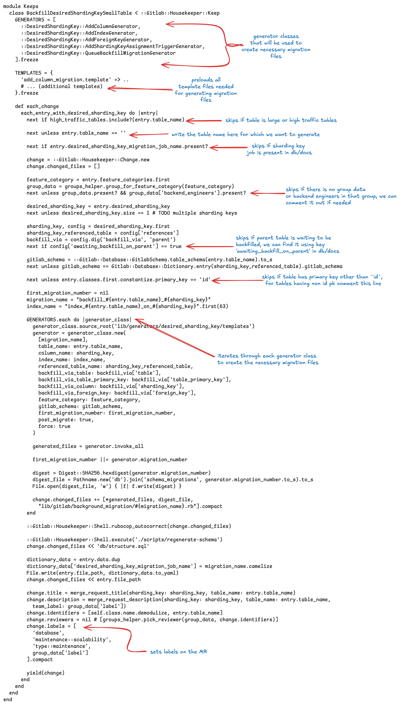
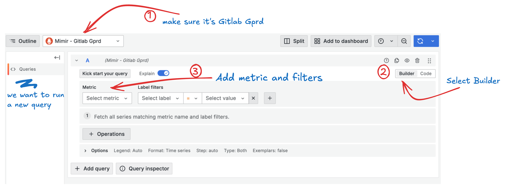
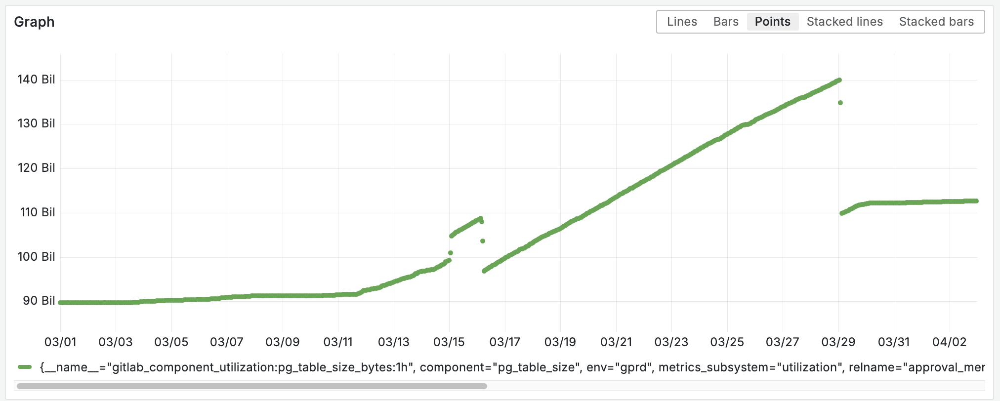
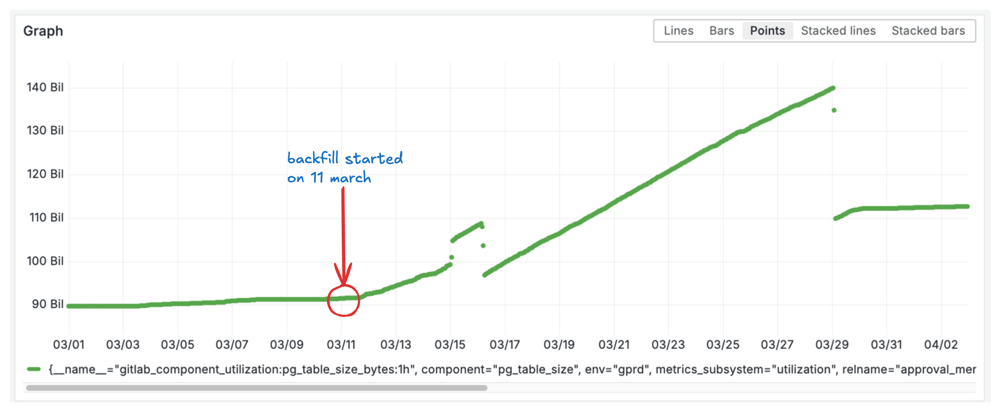
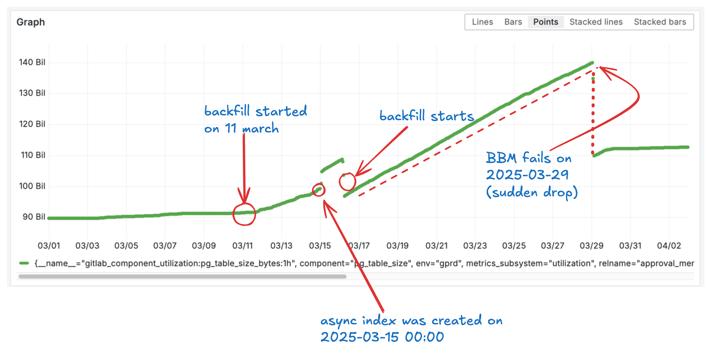

The sharding initiative is a long-running project to ensure that most GitLab database tables can be related to an `Organization`, either directly or indirectly. This involves adding an `organization_id`, `namespace_id` or `project_id` column to tables, and backfilling their `NOT NULL` fallback data. This work is important for the delivery of Cells and Organizations. For more information, see the [design goals of Organizations](https://handbook.gitlab.com/handbook/engineering/architecture/design-documents/organization/#organization-sharding).

## Sharding principles

Follow this guidance to complete the remaining sharding key work and resolve outstanding issues.

## Use unique issues for each table

We have a number of tables which share an issue. For example, [eight tables point to the same issue here](https://gitlab.com/search?search=sharding_key_issue_url%3A%20https%3A%2F%2Fgitlab.com%2Fgitlab-org%2Fgitlab%2F-%2Fissues%2F493768&nav_source=navbar&project_id=278964&group_id=9970&search_code=true&repository_ref=master). This makes tracking progress and resolving blockers difficult.
You should break out these shared issues into a single one per table, and update the YAML files to match.

## Define a sharding key

### 1: Add column, triggers, indexes, and foreign keys

This is the step where we add the sharding key column, indexes, foreign keys and necessary triggers.

**1. Steps to set up:**

1. Set up the keys required by Housekeeper: `export HOUSEKEEPER_TARGET_PROJECT_ID=278964` (project ID of GitLab project).
1. Create a new PAT for yourself: `export HOUSEKEEPER_GITLAB_API_TOKEN=<your-pat>`.
1. Update the local master branch: `git checkout master && git pull origin master --rebase`.
1. Switch to the `sharding-key-backfill-keeps` branch with the following command:

   ```shell
   git checkout sharding-key-backfill-keeps
   ```

    > You can also find the branch in the [MR](https://gitlab.com/gitlab-org/gitlab/-/merge_requests/143774).

1. Rebase this branch on top of master and push the changes back to origin. This makes sure that this branch is aware of changes in master:

   ```shell
   git pull origin master --rebase
   ```

1. Run the following command to push back rebased changes to the branch, and omit `LEFTHOOK=0` (otherwise, RuboCop fails):

   ```shell
   LEFTHOOK=0 git push --force-with-lease -o ci.skip
   ```

- Run `bundle install` and migrations.

> Do not push any changes to this branch, just keep rebasing.

**2. Steps to create automated MR:**

We store sharding key keeps for the small table and large table inside the [keeps directory](https://gitlab.com/gitlab-org/gitlab/-/tree/sharding-key-backfill-keeps/keeps). The file name starts with `backfill_desired_sharding_key_*.rb`.

Let's understand the [small table keep](https://gitlab.com/gitlab-org/gitlab/-/blob/6c0f8751b033864590bee121a5ae846a66457dfd/keeps/backfill_desired_sharding_key_small_table.rb):



The keep file contains code that:

- Defines a `Housekeeper::Keep` class for backfilling desired sharding keys on small tables
- Sets change types to include `::Keeps::DesiredShardingKey::CHANGE_TYPES`
- Iterates through entries in `database_yaml_entries`
- For each entry, adds the sharding key column if needed, including indexes, triggers, and foreign keys

1. Open the keep file and add `next unless entry.table_name == 'table name'`. Here, the table name will be the name of the table we want to create migrations for.

1. Perform a quick check based on the `desired_sharding_key` configuration of the table. Is the configuration correct? Does the sharding key of the parent table include a `NOT NULL` constraint as expected? If not, skip that table and go for another one. If the table is OK, we can proceed.

1. Let's check the table's primary key. Run the following commands in your terminal:

   - `gdk psql`
   - `\d <table_name>`

1. Running the above command will give you useful information about the tables, such as indexes, pk, etc. For example, the `security_scans` table looks like:

    

    The output shows:
    - Table: `public.security_scans`
    - Columns: `id` (bigint, not null), `created_at` (timestamp), `updated_at` (timestamp), `build_id` (bigint, not null), `scan_type` (smallint, not null), and other fields
    - Primary key: `security_scans_pkey` (btree on `id`)
    - Indexes: Including `index_security_scans_on_build_id` and `index_security_scans_on_project_id`
    - Foreign keys: Including references to `ci_builds` and `projects`

1. This is important because we have many cases where the primary key is composite, non unique, etc., and requires some manual changes in the keep.

1. Do a dry run of the execution as it will show you the generated changes and won't commit anything:

   - `bundle exec gitlab-housekeeper -k Keeps::BackfillDesiredShardingKeySmallTable -d`

1. If dry run looks good then run the same command without -d flag:

   - `bundle exec gitlab-housekeeper -k Keeps::BackfillDesiredShardingKeySmallTable`

   - Running the above command will create a MR with the changes 🎉

> Follow the same methods for large tables and use the large table keep. The only difference is that the table won't have a FK for performance reasons.

**Some useful hacks:**

**1. Tables containing non :id primary key**

1. Replace :id with non-ID primary key [in the first diff](https://gitlab.com/gitlab-org/gitlab/-/merge_requests/143774/diffs#0d5f33d9793cf940dfdaca2d13dc36ffba642547_0_16), [in the second diff](https://gitlab.com/gitlab-org/gitlab/-/merge_requests/143774/diffs#0d5f33d9793cf940dfdaca2d13dc36ffba642547_0_31) and [in the third diff](https://gitlab.com/gitlab-org/gitlab/-/merge_requests/143774/diffs#a43ac76c906b5de1a49f01a1b9d3df52db53d824_0_18).
1. Comment this line [in this diff](https://gitlab.com/gitlab-org/gitlab/-/merge_requests/143774/diffs#9e60f08042851b8f971e69edf1b7ecf0c3650bad_0_121).
1. Add a line in [this file](https://gitlab.com/gitlab-org/gitlab/-/blob/sharding-key-backfill-keeps/lib/generators/desired_sharding_key/templates/batched_background_migration_job_spec.template?ref_type=heads#L10) `let(:batch_column) { :non-id-pk }` like we did [in this example](https://gitlab.com/gitlab-org/gitlab/-/merge_requests/165940/diffs#13b28b3d4235b2108dee9bad7345da521f72fb09_0_12).

   Example MR: [!165940 (merged)](https://gitlab.com/gitlab-org/gitlab/-/merge_requests/165940) if the table uses `gitlab_ci` db then we need to specify `migration: :gitlab_ci` in migration files.

**2. Tables containing composite primary keys (more than one)**

1. Get the table information and check if either of the primary key columns has UNIQUE indexes defined, if YES then use that as primary key and batch column like we did above.
1. If none of the columns are unique, then we need to manually add changes.
1. Let's take an example of the `deployment_merge_requests` table. This is a table with non-unique composite primary keys `"deployment_merge_requests_pkey" PRIMARY KEY, btree (deployment_id, merge_request_id)`.
1. We have used [cursor based batching](https://gitlab.com/gitlab-org/gitlab/-/merge_requests/169557).
1. First, generate the changes using keep, then edit the changes.
1. Open the queue backfill post migrate file and remove all the changes and add new. For example:

    

    Example MR: [!183738 (merged)](https://gitlab.com/gitlab-org/gitlab/-/merge_requests/183738)

1. The above changes style can be used for other tables with such specifications too.
1. Open the `lib/gitlab/background_migration/backfill_*.rb` and remove all the changes generated by keep and add:

    

    See [!183738](https://gitlab.com/gitlab-org/gitlab/-/merge_requests/183738/diffs#diff-content-c2163b12dc5e47a609975eef6d8ee2674c6e1846).

1. If the table is large, add the sharding key to ignored FK list `:ignored_fk_columns_map` in [schema_spec.rb](https://gitlab.com/gitlab-org/gitlab/-/blob/master/spec/db/schema_spec.rb?ref_type=heads#L30).
1. Make sure to also update the [specs](https://gitlab.com/gitlab-org/gitlab/-/merge_requests/183738/diffs#diff-content-82b15af453642aa441801a31b12e5b3c22b009b7).

   More examples: [!183047 (merged)](https://gitlab.com/gitlab-org/gitlab/-/merge_requests/183047), [!176714 (merged)](https://gitlab.com/gitlab-org/gitlab/-/merge_requests/176714).

**3. Tables in different database**

- It might be the case that the table is in `ci` db and the sharding key is in `main` db.
- For example, `dast_site_profiles_builds` is in `sec` db and the sharding key table `projects` is in main db.
- For this you may need to add a LFK - loose foreign key, example: [MR created by housekeep](https://gitlab.com/gitlab-org/gitlab/-/merge_requests/167768) and later we added [LFK](https://gitlab.com/gitlab-org/gitlab/-/blob/master/config/gitlab_loose_foreign_keys.yml?ref_type=heads#L286).
- Make sure to add  `migration: :gitlab_sec` in the [backfill spec](https://gitlab.com/gitlab-org/gitlab/-/merge_requests/167768/diffs#04d2561fe8663e64037400b6c44818d373a32b13_0_8) and [queue spec](https://gitlab.com/gitlab-org/gitlab/-/merge_requests/167768/diffs#5c58df6768de80184fd5871af10b1ddb7f52ba82_0_6).
- Normal FK won't work as they are in different db.
- For the parent table `dast_site_profiles` we have [LFK to projects](https://gitlab.com/gitlab-org/gitlab/-/blob/master/config/gitlab_loose_foreign_keys.yml?ref_type=heads#L278).
- If table `dast_site_profiles_builds` has FK relation to its parent table `dast_site_profiles` with CASCADE delete then records will get deleted when the associated `dast_site_profiles` records are deleted.
- But it's also good to add a LFK entry for `dast_site_profiles_builds`.

  ```yaml
   dast_site_profiles_builds:
     - table: projects
       column: project_id
       on_delete: async_delete
   ```

### 2: Finalization Migration

Once the column has been added and the backfill is finished we need to finalize the migration. We can check the status of queued migration in `#chat-ops-test` Slack channel.

- `/chatops run batched_background_migrations list --job-class-name=<desired_sharding_key_migration_job_name>` to check the status of a particular job

- Output will look something like:

  

  The chatops output displays:
  - Job class name
  - Table name
  - Status (e.g., `finished`, `active`, `paused`)
  - Progress percentage

1. Once it’s 100% create a new branch from master and run: `bundle exec rails g post_deployment_migration finalize_<table><sharding_key>`

   This will create a post deployment migration file, edit it. For example, table `subscription_user_add_on_assignments` it will look like:

   ```ruby
   class FinalizeBackfillSubscriptionUserAddOnAssignmentsOrganizationId < Gitlab::Database::Migration[2.2]
     milestone '17.6'
     disable_ddl_transaction!

     restrict_gitlab_migration gitlab_schema: :gitlab_main_cell

     def up
       ensure_batched_background_migration_is_finished(
         job_class_name: 'BackfillSubscriptionUserAddOnAssignmentsOrganizationId',
         table_name: :subscription_user_add_on_assignments,
         column_name: :id,
         job_arguments: [:organization_id, :subscription_add_on_purchases, :organization_id, :add_on_purchase_id],
         finalize: true
       )
     end

     def down; end
   end
   ```

1. It will be similar for every other table except the `job_class_name`, `table_name`, `column_name`, and `job_arguments`. Make sure the job arguments are correct. You can check the add sharding key & backfill MR to match the job arguments.
1. Once it’s done, run `bin/rails db:migrate` and update key `finalized_by` in db/docs. Example MR: [!169834](https://gitlab.com/gitlab-org/gitlab/-/merge_requests/169834).

- You are all set. Git commit and create MR 🎉

### 3. Add a NOT NULL constraint

The last step is to make sure the sharding key has a `NOT NULL` constraint.

**1. Small tables**

1. Create a post deployment migration using `bundle exec rails g post_deployment_migration <table_name>_not_null`

   For example, table subscription_user_add_on_assignments:

   ```ruby
   class AddSubscriptionUserAddOnAssignmentsOrganizationIdNotNull < Gitlab::Database::Migration[2.2]
     milestone '17.6'
     disable_ddl_transaction!

     def up
       add_not_null_constraint :subscription_user_add_on_assignments, :organization_id
       end

     def down
       remove_not_null_constraint :subscription_user_add_on_assignments, :organization_id
     end
   end
   ```

1. Run `bin/rails db:migrate`.
1. Open the corresponding `db/docs.*.yml` file, in this case `db/docs/subscription_user_add_on_assignments.yml` and remove `desired_sharding_key` and `desired_sharding_key_migration_job_name`  configuration and add the `sharding_key`.

   ```yaml
   sharding_key:
   organization_id: organizations
   ```

- Example MR: [Add NOT NULL for sharding key on subscription_user_add_on_assignments](https://gitlab.com/gitlab-org/gitlab/-/merge_requests/170136/diffs)

**2. Large tables or tables that exceed runtime**

In this case we have to add async validation before we can add the sharding key. It will be a 2 MR process. Let’s take an example of table `packages_package_files`.

*Step 1 (MR 1): [Add NOT NULL for sharding key on packages_package_files](https://gitlab.com/gitlab-org/gitlab/-/merge_requests/184630/diffs)*

1. Create a [post deployment migration](https://gitlab.com/gitlab-org/gitlab/-/merge_requests/184630/diffs#cf4ce3e2d6f2d05856d6d51ccd69955154aab90e_0_8) to add not null constraint with `validate: false`.

    

    ```ruby
    class AddPackagesPackageFilesProjectIdNotNull < Gitlab::Database::Migration[2.2]
      milestone '17.11'
      disable_ddl_transaction!

      def up
        add_not_null_constraint :packages_package_files, :project_id, validate: false
      end

      def down
        remove_not_null_constraint :packages_package_files, :project_id
      end
    end
    ```

1. Create another post deployment migration to [prepare async constraint validation](https://gitlab.com/gitlab-org/gitlab/-/merge_requests/184630/diffs#5e57a29e756749835c6a45c151ad673a54230058_0_10).

   ```ruby
   class PreparePackagesPackageFilesProjectIdNotNullValidation < Gitlab::Database::Migration[2.2]
     disable_ddl_transaction!
     milestone '17.11'

     CONSTRAINT_NAME = :check_43773f06dc

     def up
       prepare_async_check_constraint_validation :packages_package_files, name: CONSTRAINT_NAME
     end

     def down
       unprepare_async_check_constraint_validation :packages_package_files, name: CONSTRAINT_NAME
     end
   end
   ```

- Run `bin/rails db:migrate` and create the MR with changes.

*Step 2 (MR 2): [Validate project_id NOT NULL on packages_package_files](https://gitlab.com/gitlab-org/gitlab/-/merge_requests/185064/diffs)*

1. Once the MR in Step 1 is merged, wait for a couple of days to prepare, you can check the status on <https://console.postgres.ai/>, just ask the joe instance bot for the table information. Look for `Check constraints`.

   - Sharding key `project_id` will appear NOT VALID.

   ```shell
   Check constraints:
     "check_43773f06dc" CHECK (project_id IS NOT NULL) NOT VALID
   ```

1. Once it’s there we can create a new post deployment migration to [validate the not null constraint](https://gitlab.com/gitlab-org/gitlab/-/merge_requests/185064/diffs#6bc3faf674b76d8c4c2766b7e174e99e54bf185e_0_7). It will be a no-op down migration.
1. Run `bin/rails db:migrate` and remove the following add constraint from `structure.sql` and add it to table definition:

   - Remove:

   ```sql
   ALTER TABLE packages_package_files
        ADD CONSTRAINT check_43773f06dc CHECK ((project_id IS NOT NULL)) NOT VALID;
   ```

   - Add:

   ```sql
   CREATE TABLE packages_package_files (
       .
       .
       CONSTRAINT check_43773f06dc CHECK ((project_id IS NOT NULL)),
   );
   ```

1. Open the corresponding `db/docs.*.yml` file, in this case `db/docs/packages_package_files.yml`, and remove `desired_sharding_key` and `desired_sharding_key_migration_job_name` configuration and add the `sharding_key`.

1. Create the MR with label `pipeline:skip-check-migrations` as reverting this migration is intended to be `#no-op`.


Pipelines might complain about a missing FK. You must add the FK to `allowed_to_be_missing_foreign_key` in [sharding_key_spec.rb](https://gitlab.com/gitlab-org/gitlab/-/blob/master/spec/lib/gitlab/database/sharding_key_spec.rb?ref_type=heads#L81).


### 4. Debug Failures

#### 1. Using Kibana

There will be certain cases where you can get failure notification after queuing the backfill job. One way is to use the [kibana logs](https://log.gprd.gitlab.net/).

> Note: We only store kibana logs for 7 days

Let’s take the recent `BackfillPushEventPayloadsProjectId` BBM failure as an example.

- Failures are also reported as a comment on backfilled original MR. Example: MR [!183123](https://gitlab.com/gitlab-org/gitlab/-/merge_requests/183123#note_2482744925)

  

- We can also check the status of the job in `#chat-ops-test` Slack channel, using `/chatops run batched_background_migrations list --job-class-name=<desired_sharding_key_migration_job_name>`.

  

- Let’s figure out the reason for failure using [kibana dashboard](https://log.gprd.gitlab.net/app/discover).

1. Make sure the data view is set to `pubsub-sidekiq-inf-gprd*`.

    

1. On the left side, you can see all the available fields. We only need `json.job_class_name` i.e. desired sharding key migration job name and the `json.new_state: failed`.

    

1. Let’s add those filters to get the desired logs.

    

1. Set `json.job_class_name` to `BackfillPushEventPayloadsProjectId` in this case and `json.new_state` to `failed` and apply the filter.

    

1. Make sure to select the right timeline, since this migration was reported as a failure a few days ago I will filter it to show only the last 7 days.

    

1. After that you will see the desired logs with added filters.

    

1. Let’s expand the logs and find `json.exception_message`.

    

- As you can see this BBM was failed due to `Sidekiq::Shutdown` 😡.

- To fix it, just requeue the migration.

#### 2. Using Grafana

Sometimes you won't find anything on kibana since we only store logs up to 7 days. For this, we can use the [Grafana dashboard](https://dashboards.gitlab.net/).

Let’s take the recent `BackfillApprovalMergeRequestRulesUsersProjectId` BBM failure as an example.

- You’ll be tagged on the original MR.

  

1. We can also check the status of the job in `#chat-ops-test` Slack channel, using `/chatops run batched_background_migrations list --job-class-name=<desired_sharding_key_migration_job_name>`.

    

1. Let's check the kibana dashboard. There are [no logs](https://log.gprd.gitlab.net/app/discover#/view/07cd7a8b-10bb-457c-8d25-3c6d6269e614?_g=h@9751b81&_a=h@ff28b71) for this job.
1. Let's go to the [Grafana dashboard](https://dashboards.gitlab.net/explore).

    

1. Click on `Explore` and add a new query.

    

1. The easiest way to debug sharding key failures is to check the table size anomaly.

    

- Metric: `gitlab_component_utilization:pg_table_size_bytes:1h`.
- Label filters:
  - `env: gprd`.
  - `type: patroni`.
  - `relname: approval_merge_request_rules_users`.

1. Timeline: select at least a few days prior to the date of job creation. You can see in the MR that failure was reported on [2025-03-31](https://gitlab.com/gitlab-org/gitlab/-/merge_requests/183354#note_2425371444) and the job was created on **2025-03-11**. I have selected the time range from **2025-03-01** to **2025-04-02**. You can adjust it accordingly.
1. After running the query a graph will be generated within the selected timeframe.

    

1. Let’s make sense of this graph. Backfill job started on **2025-03-11**, you can see a slight increase in table size starting at this date.

    

    > This is very normal

1. Let’s see the changes we have added in the [post migration](https://gitlab.com/gitlab-org/gitlab/-/merge_requests/183354/diffs#396732f8126545e4961d048dbb6e81c4746b5557_0_11). First we added the `prepare_async` index. Let’s check the size on [postgres.ai](https://console.postgres.ai/gitlab/gitlab-production-main/sessions/39129/commands/120292) it’s size is 10 GB. It was created on **2025-03-15** at 00:00, as we can see in the spike in the graph.

    

1. Once the index is created, backfill starts.

    

1. The BBM fails on **2025-03-29**, you can see in the graph that at this point, table size dropped.

    

- The index + the column backfill increased the table size to approx ~20 GB compared to before the backfill, an increase of ~22% in table size, from ~90 GB to ~110 GB 🫨.

- We have a goal to keep all tables [under 100 GB](../../database/large_tables_limitations.md).

## Update unresolved, closed issues

Some of the issues linked in the database YAML docs have been closed, sometimes in favor of new issues, but the YAML files still point to the original URL.
You should update these to point to the correct items to ensure we're accurately measuring progress.

## Add more information to sharding issues

Every sharding issue should have an assignee, an associated milestone, and should link to blockers, if applicable.
This helps us plan the work and estimate completion dates. It also ensures each issue names someone to contact in the case of problems or concerns. It also helps us to visualize the project work by highlighting blocker issues so we can help resolve them.

Note that a blocker can be a dependency. For example, the `notes` table needs to be fully migrated before other tables can proceed. Any downstream issues should mark the related item as a blocker to help us understand these relationships.
